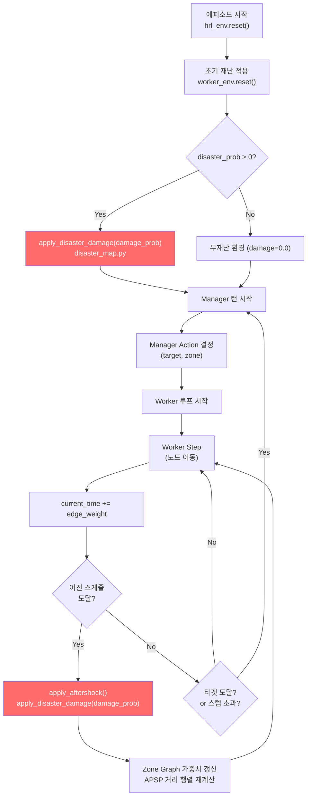
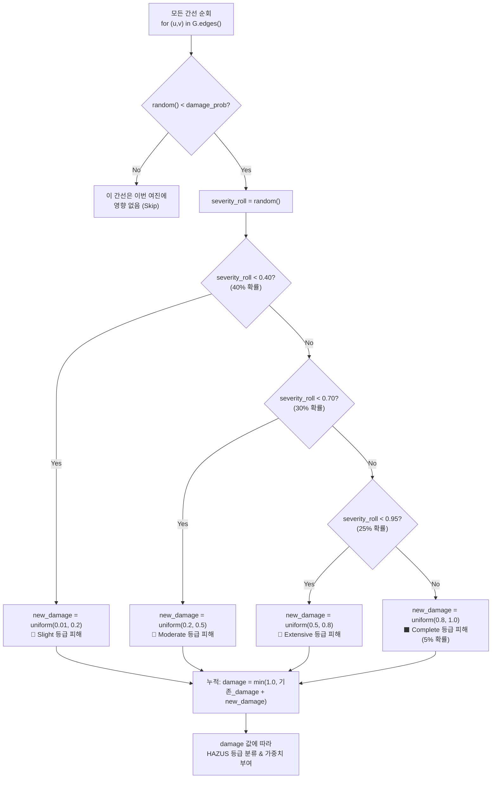

# 재난 피해(Damage) 부여 흐름

## 1. 전체 흐름도



## 2. 데미지 부여 메커니즘 상세 (`apply_disaster_damage`)

### 2.1. 호출 시점

| 시점 | 호출 위치 | damage_prob | 목적 |
|------|----------|-------------|------|
| **에피소드 리셋** | `worker_env.reset()` | `self.disaster_prob` (0.0~0.2) | 초기 재난 상태 생성 |
| **여진 발생** | `worker_env.apply_aftershock()` | `self.disaster_prob` (0.05) | 에피소드 중 동적 재난 추가 |
| **에피소드 리셋 (초기화)** | `worker_env.reset()` | `0.0` (또는 음수) | 모든 간선 원상 복구 |

### 2.2. 개별 간선 데미지 결정 과정



### 2.3. 피해 강도 확률 분포 (Severity Roll)

```
severity_roll ∈ [0, 1) 에서의 구간별 할당:

0.00 ━━━━━━━━━━━━━━━━ 0.40 ━━━━━━━━━━━ 0.70 ━━━━━━━━━━━━ 0.95 ━━ 1.00
│      Slight (40%)      │  Moderate (30%)  │  Extensive (25%)  │ Complete │
│   damage: 0.01~0.2     │  damage: 0.2~0.5 │  damage: 0.5~0.8  │ 0.8~1.0  │
│                        │                  │                   │  (5%)    │
```

### 2.4. 데미지 누적 모델

데미지는 **누적(Cumulative)** 방식:

```
damage_t = min(1.0, damage_{t-1} + new_damage)
```

- 여진이 반복될수록 같은 간선의 damage가 점점 증가
- 예: Slight(0.15) + Slight(0.18) = 0.33 → Moderate 등급으로 승격
- 최대값 1.0으로 클램프

### 2.5. HAZUS 등급별 가중치 부여 (현재 → 변경 예정)

| 누적 Damage | HAZUS 등급 | 현재 Weight | **변경 예정 Weight** | 근거 |
|------------|-----------|------------|-------------------|----|
| 0.0 ~ 0.2 | Slight (Normal) | base × 1.1 | **base × 1.0** | Residual Capacity 100% |
| 0.2 ~ 0.5 | Moderate (Caution) | base × 1.2 | **base × 2.0** | Residual Capacity 50% |
| 0.5 ~ 0.8 | Extensive (Danger) | base × 1.5 | **base × 4.0** | Residual Capacity 25% |
| 0.8 ~ 1.0 | Complete (Closed) | **간선 삭제** | **base × 20.0** (Soft Closure) | Residual Capacity ~5% (UGV) |

### 2.6. 건물 피해 연동

간선에 건물이 있는 경우 (`has_building=True`), damage 값에 비례하여 부상자 발생:

```python
injury_rate = damage * random.uniform(0.5, 1.0)
num_injured = int(total_people * injury_rate)
```

- damage가 높을수록 부상자 비율 증가
- 이 부상자 데이터는 현재 Rescue Rate에 직접적으로 사용되지는 않음

## 3. 여진 스케줄링 (현재 → 변경 예정)

### 현재: Manager 턴 기반 스케줄

```python
# hrl_env.py L155-160
num_aftershocks = random.randint(2, 5)       # 에피소드당 2~5회
max_turns = 20                                # Manager 최대 턴 수
aftershock_schedule = set(random.sample(      # 턴 번호 기반 스케줄
    range(1, max_turns), 
    min(num_aftershocks, max_turns - 1)
))

# 트리거 조건 (hrl_env.py L331-334):
if self.global_step in self.aftershock_schedule:
    self.env.apply_aftershock()
```

### 변경 예정: 시간 축(current_time) 기반 스케줄

```python
# 에피소드 시작 시:
num_aftershocks = random.randint(8, 15)
interval = max_time / (num_aftershocks + 1)
aftershock_times = sorted([
    interval * (i + 1) + random.uniform(-interval * 0.3, interval * 0.3)
    for i in range(num_aftershocks)
])

# Worker 매 스텝마다 체크:
while aftershock_cursor < len(aftershock_times) and current_time >= aftershock_times[aftershock_cursor]:
    apply_micro_aftershock()
    aftershock_cursor += 1
```

**시간 기반의 이점**: 느린 알고리즘(GA: 16초)은 같은 시간 동안 더 많은 여진을 경험, 빠른 알고리즘(HRL: 2초)은 적게 경험.
