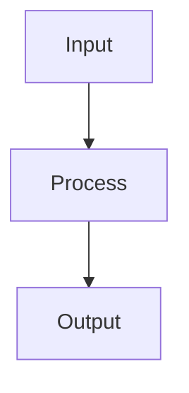

# 🏗️ Task Blueprint

*(System Note: Output the filled content of this template to the user in Professional Korean)*

### 1. Core Intent
*   [Exact engineering objective and architectural approach]

### 2. Affected Files & Data Schemas
| Target File | Modifications | Expected Type Hint / Pydantic Model |
| :--- | :--- | :--- |
| `src/...` | ... | `dict[str, Any]` |

### 3. Logic Visualization (Visual Walkthrough)

### 4. Step-by-Step Execution Plan
1.  [Step 1 - Include physical tool usage]
2.  [Step 2 - Include physical tool usage]
