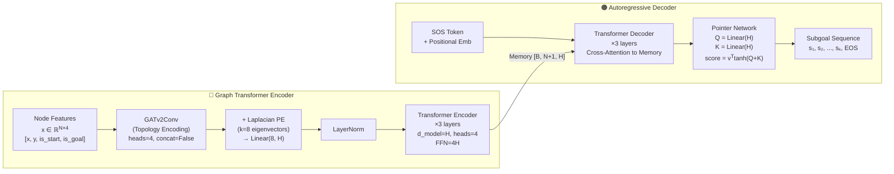
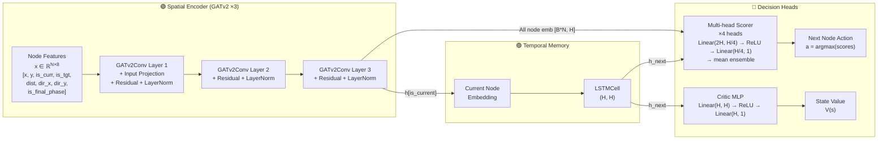

# Figure 2. Neural Network Architecture

> 아래 Mermaid 코드를 [Mermaid Live Editor](https://mermaid.live) 또는 VS Code Mermaid 플러그인으로 렌더링하세요.

## (a) Manager: Graph Transformer with Pointer Network

## (b) Worker: GATv2-LSTM with Multi-head Scorer

## (c) Tensor Shape Summary

| Component | Input Shape | Output Shape | Parameters |
|-----------|-------------|--------------|------------|
| Manager GATv2 | [B×N, 4] | [B×N, H] | heads=4, edge_dim=5 |
| Manager LPE | [N, 8] | [N, H] | Linear(8, H) |
| Manager TF Encoder | [B, N, H] | [B, N, H] | 3 layers, 4 heads |
| Manager TF Decoder | [B, L, H] | [B, L, H] | 3 layers, 4 heads |
| Manager Pointer | [B, L, H] × [B, N+1, H] | [B, L, N+1] | v ∈ ℝ^H |
| Worker GATv2 ×3 | [B×N, 8] | [B×N, H] | Residual, heads=4 |
| Worker LSTM | [B, H] | [B, H] | LSTMCell |
| Worker Scorer | [B×N, 2H] | [B×N, 1] | 4-head ensemble |
| Worker Critic | [B, H] | [B, 1] | 2-layer MLP |

*H = hidden_dim (default: 256)*
