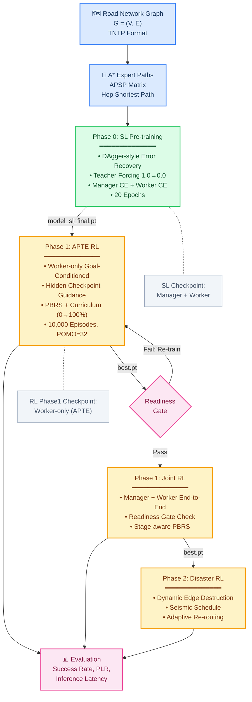

# Figure 3. Training Pipeline

> 아래 Mermaid 코드를 [Mermaid Live Editor](https://mermaid.live) 또는 VS Code Mermaid 플러그인으로 렌더링하세요.

## Pipeline Summary

| Phase | 목적 | 입력 | 출력 | 핵심 기법 |
|-------|------|------|------|-----------|
| Phase 0 (SL) | 기본 경로 모방 | A* Expert Paths | `model_sl_final.pt` | DAgger, Teacher Forcing |
| Phase 1 (APTE) | Goal-conditioned 강화 | SL Checkpoint | `best.pt` (Worker) | Hidden Checkpoints, PBRS, Curriculum |
| Phase 1 (Joint) | Manager-Worker 조율 | Phase 1 APTE best | `best.pt` (Joint) | Stage-aware PBRS, Readiness Gate |
| Phase 2 (Disaster) | 재난 적응 | Joint best | `rl_finetune_phase2/` | Dynamic Edge, Seismic Schedule |
